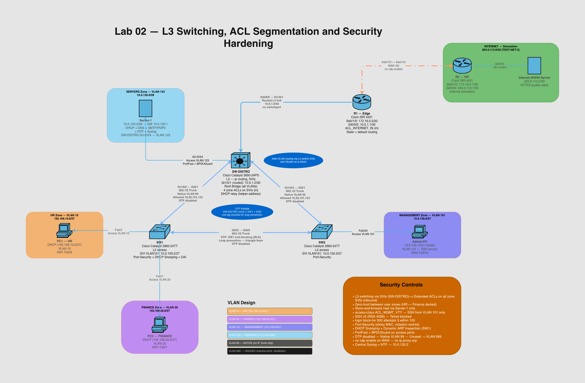

# Lab 02 — L3 Switching, ACL Segmentation & Security Hardening

Enterprise-style network built in Cisco Packet Tracer, where four internal zones are routed by a Layer 3 distribution switch and firewalled against each other by a zone-based ACL policy designed from scratch.

This is the second lab in a series. [Lab 01](https://github.com/tomasz-netlab/network-lab-vlan-intervlan-routing) implemented inter-VLAN routing with router-on-a-stick; this one uses the alternative approach — SVIs on a multilayer switch — and shifts the focus from routing mechanics to **designing and enforcing a security policy**.

---

## Objective

Build a segmented network where every packet crossing a zone boundary is checked against a written policy, and prove — with both permit and deny tests — that the policy is actually enforced.

The routing is a means, not the point. The point is the ACL design: a coherent security posture where every rule traces back to a stated business reason, rather than a collection of isolated commands that happen to work.

Secondary goals:
- Practise Layer 3 switching (SVIs) as the alternative to Lab 01's router-on-a-stick
- Add the Layer 2 anti-spoofing controls Lab 01 didn't have — DHCP Snooping, Dynamic ARP Inspection, Port Security
- Design the IP addressing from scratch rather than reusing a previous plan

---

## The ACL design process

The distinguishing feature of this lab. Rather than writing rules ad hoc, the policy was designed in four layers before any configuration was typed:

**1. Zones and policy** — what the zones are and the rules governing traffic between them, in plain language. Zero-trust between user zones, store-and-forward mail through a single hub, HR as the only zone with internet access.

**2. Traffic Flow Matrix** — every permitted and denied flow between zones, each given an ID (F-01 … F-99). Return traffic is a separate flow, because these ACLs are stateless.

**3. ACL Deployment Map** — which ACL enforces which flows, on which interface, in which direction.

**4. ACL Detail Sheet** — the rules themselves, each tied back to a flow ID.

The payoff came during troubleshooting: when something broke, the question was never "is this rule wrong?" but "which flow is this, and does the rule match it?" — a much smaller question. It also makes the result auditable: any ACL line can be traced to a flow, and any flow to a policy decision.

Full detail in [docs/acl-design.md](docs/acl-design.md).

---

## Topology

| Device | Model | Role |
| ------ | ----- | ---- |
| R2 | Cisco ISR 4331 | ISP simulation, upstream of the edge |
| R1 | Cisco ISR 4331 | Edge router — WAN link, edge ACL, default routing |
| SW-DISTRO | Cisco Catalyst 3650-24PS | L3 distribution — inter-VLAN routing via SVIs, root bridge, zone ACLs, DHCP relay |
| SW1 | Cisco Catalyst 2960-24TT | L2 access — HR and Finance hosts, full L2 security stack |
| SW2 | Cisco Catalyst 2960-24TT | L2 access — Admin workstation |
| Server-1 | Server-PT | DHCP, DNS, SMTP/POP3, NTP, Syslog |
| Internet-WWW-Server | Server-PT | Public HTTPS server behind R2 |
| PC1-HR / PC2-FINANCE | PC-PT | User hosts (DHCP) |
| Admin-PC | PC-PT | Administrative workstation (static, SSH source) |

SW-DISTRO, SW1 and SW2 are cabled in a triangle, giving a redundant path at the cost of a Layer 2 loop — managed by STP with SW-DISTRO as the explicit root bridge.

---

## IP Addressing

Address space is split by purpose: `192.168.x.x` for user zones, `10.0.x.x` for infrastructure. Reading any address tells you which category it belongs to.

| VLAN | Name | Subnet | Gateway (SVI) |
| ---- | ---- | ------ | ------------- |
| 10 | HR | 192.168.10.0/27 | 192.168.10.1 |
| 20 | FINANCE | 192.168.20.0/27 | 192.168.20.1 |
| 101 | MANAGEMENT | 10.0.100.0/27 | 10.0.100.1 |
| 123 | SERVERS | 10.0.120.0/28 | 10.0.120.1 |
| 99 | NATIVE | — (trunk only, no hosts) | — |
| 999 | UNUSED | — (disabled ports) | — |

Point-to-point links use /30: R1↔SW-DISTRO `10.0.1.0/30`, R1↔R2 `172.16.0.0/30`, R2↔web server `203.0.113.0/30` (TEST-NET-3).

HR and Finance are DHCP (relayed to Server-1); Management and Servers are static. Full plan, including port mapping and design rationale, in [docs/addressing-plan.md](docs/addressing-plan.md).

---

## Security Policy

| Zone | Internet | Mail | Notes |
| ---- | -------- | ---- | ----- |
| HR | HTTPS only | via Server-1 | The only zone allowed outbound |
| FINANCE | none | via Server-1 | Has sFTP to the server; HR does not |
| MANAGEMENT | none | to Admin-PC only | Full service access to Servers; SSH source |
| SERVERS | DNS + SMTP relay only | — | Store-and-forward hub for all zones |

HR and Finance cannot reach each other directly — all exchange goes through the server. The two user zones deliberately have *different* rights rather than being copies of one template.

---

## What Was Implemented

**Layer 3**
- `ip routing` on the distribution switch, SVI per VLAN as gateway and policy-enforcement point
- Routed port (`no switchport`) to the edge router
- Static routing throughout, plus default routes toward the internet

**ACL policy**
- Five extended ACLs: four on zone SVIs (inbound), one at the edge on R1's WAN interface
- `established` for TCP return traffic, source-port matching for UDP replies
- ICMP permitted by type rather than blanket
- RFC 1918 deny blocks in front of every broad `any` permit
- `ACL_MGMT_VTY` with `access-class` restricting SSH to the Management subnet on all four managed devices

**Layer 2 security**
- Port Security — one MAC per access port, sticky learning, violation `restrict`
- DHCP Snooping on SW1, trust on uplinks only, Option 82 insertion disabled
- Dynamic ARP Inspection on the user VLANs
- DHCP Snooping database agent, so the binding table survives a reload
- PortFast + BPDUGuard on access ports
- Trunk hardening — DTP disabled, native VLAN 99 (empty, and excluded from the allowed list), restricted allowed-VLAN list
- Unused ports parked in a black-hole VLAN and shut down

**Spanning Tree**
- Rapid-PVST+ on all switches
- SW-DISTRO as explicit root bridge for the production VLANs

**Baseline hardening** (carried over from Lab 01)
- SSH v2 with RSA keys, Telnet disabled
- `login block-for 300 attempts 3 within 120`, minimum password length, `service password-encryption`
- MOTD banner, exec timeouts, `no cdp` on the WAN, `no ip proxy-arp`
- Central NTP and Syslog

---

## Validation

26 tests covering configuration, Layer 2 security and — most importantly — the policy itself. Both directions are tested: a policy is only proven when the denies work as well as the permits.

| Test | Expected | Result |
| ---- | -------- | ------ |
| HR → Finance | DENY | ✅ |
| HR → Management | DENY | ✅ |
| Finance → internet | DENY | ✅ |
| HR → internet (HTTPS) | PERMIT | ✅ |
| HR → internet (HTTP) | DENY | ✅ |
| DNS resolution via Server-1 | PERMIT | ✅ |
| Management → all zones | PERMIT | ✅ |
| Users → own gateway | PERMIT | ✅ |
| STP root bridge + blocked leg | as designed | ✅ |
| DHCP Snooping binding table | 2 clients bound | ✅ |
| Binding table after reload | restored from flash | ✅ |
| Port Security sticky MAC | learned, restrict | ✅ |

The clearest single result is the HTTPS/HTTP pair: the same host reaches the same site over 443 and is blocked on 80. Not a reachability question — proof that filtering is port-specific.

24 of 26 tests pass as designed; 2 are documented Packet Tracer limitations, not configuration faults. Full output for every test in [docs/validation.md](docs/validation.md), with 32 supporting screenshots in [evidence/](evidence/).

---

## Documentation

| Document | Contents |
| -------- | -------- |
| [addressing-plan.md](docs/addressing-plan.md) | Subnets, static hosts, DHCP scopes, port mapping, design rationale |
| [topology.md](docs/topology.md) | Architecture, security zones, key design decisions |
| [acl-design.md](docs/acl-design.md) | Zones and policy → Traffic Flow Matrix → Deployment Map → Detail Sheet |
| [implementation.md](docs/implementation.md) | How the ACLs and L2 controls are configured, and why |
| [validation.md](docs/validation.md) | All 26 tests with device output |
| [lessons-learned.md](docs/lessons-learned.md) | What broke, what it taught me, simulator limitations |

Device configurations in [configs/](configs/) — copy-paste ready, secrets redacted. Topology diagram source in [diagrams/](diagrams/).

---

## Hardening documented but not supported in Packet Tracer

- **`log` on ACEs** — the closing `deny ip any any` should be logged for security visibility; the keyword isn't available
- **ARP ACLs** — `arp access-list` isn't implemented, so the static-host workaround for DAI can't be demonstrated
- **IMAP** — permitted in the ACL policy, but the EMAIL service implements only SMTP and POP3
- **ACL on SVIs** — applied correctly and filtering (confirmed by hit counters), but not shown by `show run` and lost on reload; a known 3560/3650 defect in the simulator. The same command on a router interface displays normally
- **DAI enforcement** — configured and reporting active, but spoofed ARP passes and counters stay at zero. Verified by a deliberate spoofing test after eliminating three configuration hypotheses

Details and the diagnostic process in [lessons-learned.md](docs/lessons-learned.md).

---

## Technologies

Cisco IOS · VLANs · 802.1Q trunking · Layer 3 switching (SVIs) · Extended & standard ACLs · Static routing · DHCP relay · Rapid-PVST+ · DHCP Snooping · Dynamic ARP Inspection · Port Security · SSH · NTP · Syslog · Cisco Packet Tracer

---

## Possible Extensions

- **IP Source Guard** on the access ports, using the same binding table DAI reads from — the natural third layer after snooping and DAI
- **Named ARP ACLs** for static hosts, so DAI can cover the Management zone without breaking it
- **Reflexive or zone-based firewall rules** instead of `established`, for genuinely stateful return-traffic handling
- **HSRP/VRRP** with a second distribution switch, turning the STP triangle into real gateway redundancy
- **AAA with a RADIUS server** replacing local user accounts for device authentication
- **Rebuild on real IOS images** (CML) to validate the DAI and SVI-ACL behaviour that the simulator can't demonstrate
